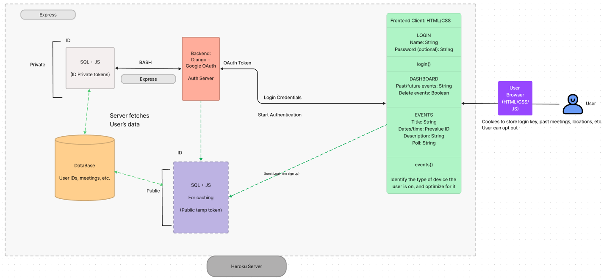

# UI Design

## Program Diagram

The following is a rough Program Diagram (or more precisely, a diagram showcasing the different technologies we plan to use, and how they might interact with each other).

Do note that the above is subject to change at any moment, andis also not completely formailzed. We just created this rough sketch as it was very helpful for us to start streamlining the entire process for developing this application, and also divide the work evenly across team members.

### **Backend Diagram**



The above roughly showcases how we plan our backend to be laid out. Before we dive more into it, the general working of the app is as follows (and this can also be looked up in more detail under the ```../ui-design``` directory).

1. There are two main types of accounts
   1. A registered account using either Django or Google OAuth (we are primarily targeting the latter)
   2. An Unregistered account/"Guest Account"
      1. Registered accounts will be able to create and share meetings, distribute them, have a nice dashboard UI to check on all their meetings, will be able to look at past meetings, and have more features in general
      2. Guest accounts are positioned to be more general in nature, they are temporary accounts for when someone else has sent you a link to meet. All data from Guest accounts are deleted once the original meeting expires.
2. Registered accounts have a proper SQL server which is accessed using OAuth
3. Guest users have a separate SQL, just containing the details for that specific meeting, and a special identifier to identify the person. These accounts will mainly be tied using the specific URL for that meeting.

Our frontend is based mainly on HTML/CSS and JavaScript, without the use of any much high-level fancy packages or modules. A full comprehensive mockup can be looked up in ```../ui-design```

As of now, we plan to use MySQL for our Server Side Architecture. We plan to have mainly two separate databases: one for all the registered users (which will help us keep track of data provided per user, and help us deliver a richer feature set). This database will only be able to be accessed through a successful authentication using Google's OAuth, or Django. 

The authentication token provided upon a successful login will corelate to the user's data on the SQL server, and that data will be fetched with the help of Express.js, a JavaScript framework well optimized for backend tasks (and maybe some Bash Scripts). Note: this is in a prelimnary stage and is subject to change in the future as our needs change and we learn about more technologies.

The second database we plan to have is a much more watered-down version of the first one, except this one will be only for guest users who are using our platform for a one-time use case. The way we plan to identify each user in this case, as opposed to the auth tokens in the previous one, is through a randomized hash coupled with the special URL for each of the meetings. This way, guest users can sign up for each of the meetings, and be able to participate without signing up. 

The only issue with the latter user type is the inability to create new meetings or utilize any of the other feature set; due to security issues. Regardless, we believe that implementing this would lower the barrier of entry, and make the application more accessible. 

These databases would essentially store different meetings, meeting information for each of the meetings, URLs for each of the meetings, people invited, and everyone's inputs. We believe using regular CSV files for each of these will be a good solution.

We also believe that a combination of Node.js and Express.js will help us achieve most of our tasks in this architecture. If it is required, we may also utilize Python for additional Database management solutions, and create an API using Flask to help communicate between Python, JS, SQL, and the rest of our website. However, the same is not yet mentioned on our diagram, since we believe that this step may not be needed most probably (but we are still open to implementing the same if required).

We plan to host our program on Heroku Server if we can get a free instance, as Heroku provides a rich feature set to deploy all parts of such an application with almost no hassles, and has a great community + amazing documentation. However, we are also looking at AWS as an alternative, since they also have almost the same feature set (along with a trial period). Even though the actual deployment process on AWS feels more complicated, we believe that both platforms will work fine at the end.

More details will be added here as we go through the development process, but this is a very rough overview of what we plan to do. Moreover, we will rely on AWS/Heroku for load balancing, DNS, etc.