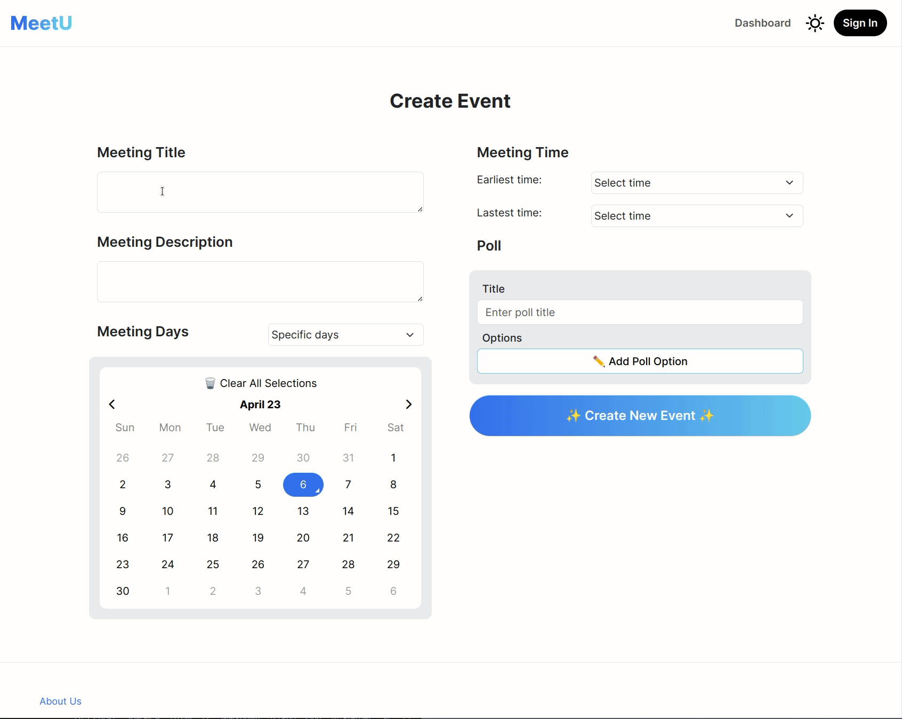

# GIF of HTML Pages

## Create new event

Here, the user fills in the input fields to create a new event schedule. We are planning to distinguish between required and optional fields. The constraints will be checked when the user clicks on the "Create New Event" button.

Showcase of Meeting Day selection options. User can choose between selecting specific dates vs. days of the week (Sunday-Saturday).

Showcase of light and dark mode switch.

We used Bootstrap 5 to ensure responsive design. The app changes layout depending on the user device's screen size, creating a better user experience for those who access MeetU with their mobile devices.

An uninteractive HTML mockup of the dashboard. Create new item button is missing.
