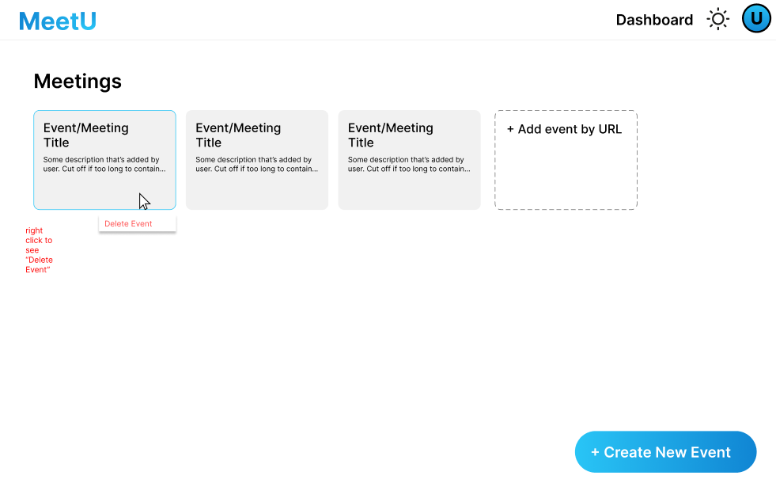
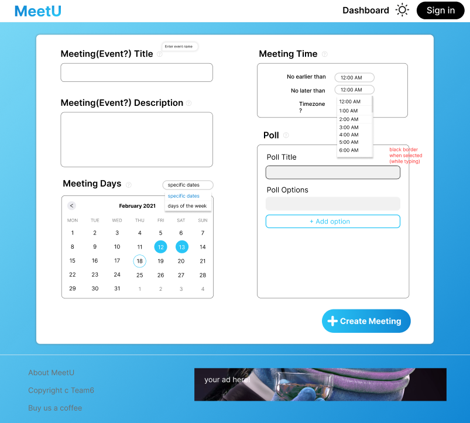

# UI Design

## Wireframe

MeetU: A better way to schedule and organize meetings. 

### **WireFrame 1: Dashboard**

This page displays a dashboard of a list of past meetings. Each meetings are given a description by the user about the event itself. By right clicking the event, the user can view a delete event option if they want to remove the meeting on the dashboard. The user can click +Create New Event box on the bottom right corner to create a new meeting which will direct them to a "Create New Event" page. On the top right corner, there is your user profile and dashboard button shown. There is also an optional darkmode button on the top right corner if you are a light theme hater.
 

### **WireFrame 2: Create new Events**

User can type out the title and description within the textbook about the created meeting. The user can also select a specific date or day of the week from the dropdown and choose a specific day based on the given calendar. On the meeting time, there is a dropdown menu for between given specfic times and timezone that the user wishes to choose from. Below that is a poll of whatever subject they want to make it about (e.g. location) that the user can decided to dislay for other members to choose based on the poll option. After filling out everything down, the user can click the button "+Create Meeting". 

_Other several features shown above_

### **WireFrame 3: Selecting Time Availabilities**

After creating a new event, the user must enter their name and an optional password before selecting time availabilities of the new event. This is so that the meeting can show participants and members of the event. The user can also Sign In to MeetU without having to enter their name for every new created event made.

With the login all set up, the user can then choose their preferred time availabilities by dragging down and highlighting the times for any day they choose. The right side of your availability is the group's availability which displays all member's time avaialability. The darker the availability times art, the more people is on that time. The poll shown below is set by the creator of this meeting and displays a list of poll options. Summary section just displays extra description of the meeting (participant members, preferred meeting times and polls).

## Stories

### Story 1: Success story of a user

A CS 326 student wants to schedule a new meeting to discuss their project. The leader decides to register on MeetU using their own Google account. Once the account is created, the “Create New Event” window is shown, which will include the user profile (username), along with a navigation bar with “dashboard” and “logout” options.  The student decides to make the meeting name “idk😀” and selects a date time on December 21. For the time section, the leader chooses their own preferred start/end times and location options. Finally, they decided to submit their new meeting, and the browser shows a clickable timetable with a unique URL.

### Story 2: Registered user logs in and use dashboard

The user logs into MeetU by clicking on the “Log In” button at the top navigation bar. Once he’s logged in, next to the user profile, the “Dashboard” button shows up and leads to the user’s dashboard. It lists meeting items in a grid view (each item shows the meeting title. Clicking on the item leads to the time selection view of the event). On the dashboard, the user can browse events by event title and sort by creation date, or create/delete the event. The event created by the user is automatically added to the dashboard, but the events he participates in as a “member” can be added by “add item > enter URL”.

### Story 3: Guest user decides to register (will include microservices):

A user visits the MeetU website.  Since this is a new user, who has not logged in before, the user is brought to a login form. However, this user would like to create a new account and register on this website. The user has three options: the user can register with Google, using his/her username and password, or just using the platform as a guest user.  Even though the user has a Google account, the user chooses to create a new username and passes his/her email.  The email is not typed correctly, and the website shares an error message saying to provide a valid email. The user provides a valid email and username (microservices are used here to send OTP to email + do a CAPTCHA verification), and is brought to the home page.

### Story 4: User chooses a not applicable time and date for a meeting

When given a dropdown menu to select exactly what time they are available for their meeting, a user selects a start time which is in the future as compared to their end time. For example, they choose the meeting to start at 11PM on 3rd March, and end at 12AM on 3rd March. The app gives an error message stating that “Start Time Cannot Be After End Time”, and prompts the user to choose a proper valid time and date. The message goes away once the user chooses a valid End time and Start time. The user goes on with the rest of the process of setting up a meeting time and sending further invite links.

### Story 5: Selecting a meeting time when everyone has put in their availability

After every group member inputs their preferred date and time schedules, the website sends a notification in the form of an email to the original person who created the meeting. The original user then logs in and gets redirected to the home screen. Under their profile, the user can see all their meetings that they have either created or given their schedule to. The user finds the meeting for which they had got a notification for and is presented with a dashboard showcasing each user and their availability. There is also a graph view which shows what is the most popular times based on every user's time votes.

## HTML & CSS Mockup

Reiciendis velit dolorum voluptas earum. Rerum nobis accusantium laudantium minima incidunt. Magnam aut minus minus. Cumque unde voluptatibus soluta molestias perspiciatis aperiam accusantium laborum quo.

Natus est molestias est et autem non in. Laudantium consequatur facilis perferendis. Saepe similique sapiente rem ut. Laudantium natus voluptas delectus molestiae ab omnis quidem. Maxime cumque porro ea deleniti incidunt nihil cupiditate sunt. Nihil eaque porro nemo veritatis.

Ipsam architecto nulla ut dolor dolor sit mollitia deleniti minus. Velit quia iste.

## References

- [Link 1](https://example.com)
- [Link 2](https://example.com)
- [Link 3](https://example.com)